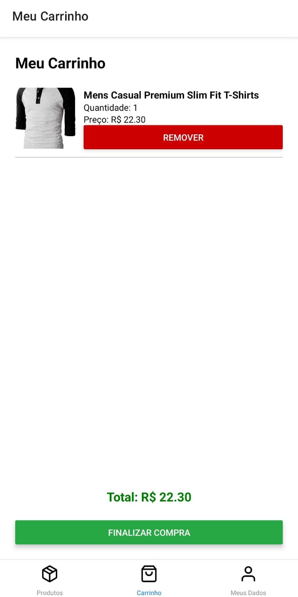
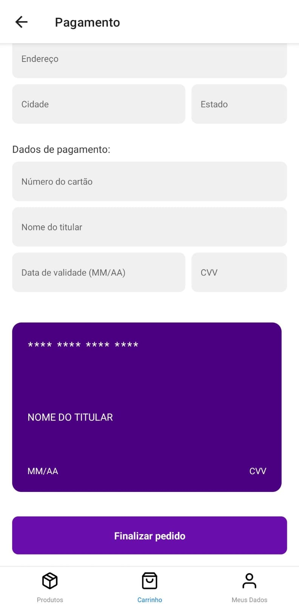

<!DOCTYPE html>
<html lang="pt-BR">
<head>
  <meta charset="UTF-8">
  <meta name="viewport" content="width=device-width, initial-scale=1.0">

</head>
<body>

<title>Carrinho de Compras - Aplicação de Pagamento e Entrega</title>

Este projeto é uma aplicação de <strong>Carrinho de Compras</strong> com uma interface de pagamento desenvolvida em <strong>React Native</strong>. A aplicação permite que o usuário selecione produtos, adicione ao carrinho, insira detalhes de pagamento e finalize a compra.

<h2>📋 Funcionalidades Principais</h2>
<ul>
  <li><strong>Adicionar e remover itens do carrinho</strong> com controle de quantidade.</li>
  <li><strong>Cálculo automático do preço total</strong> com base nos itens e quantidades no carrinho.</li>
  <li><strong>Formatação automática dos dados de pagamento</strong>, incluindo número do cartão, data de validade e CVV.</li>
  <li><strong>Armazenamento local do carrinho</strong> com <code>AsyncStorage</code> para persistência dos dados entre sessões.</li>
  <li><strong>Finalização de compra</strong> que exibe um Toast de sucesso, esvazia o carrinho e redireciona o usuário para a tela inicial.</li>
  <li><strong>Validação de formulário de pagamento</strong> para garantir que todos os campos obrigatórios sejam preenchidos antes de finalizar a compra.</li>
  <li><strong>Histórico de Pedidos</strong> para acompanhar os pedidos realizados e o status da entrega.</li>
</ul>

<h2>📝 Passo a Passo de Utilização</h2>

<ol>
  <li>
    <strong>Escolhendo um Produto</strong> 
    Ao abrir o aplicativo, você verá uma lista de produtos disponíveis. Selecione o produto que deseja comprar tocando sobre ele, o que o redirecionará para a tela de detalhes do produto.
  </li>
  <li>
    <strong>Adicionando ao Carrinho</strong> 
    Na tela de detalhes do produto, veja as informações detalhadas como descrição, preço e opções (caso existam). Para adicionar o produto ao carrinho, clique no botão "Adicionar ao Carrinho". Após isso, você será redirecionado automaticamente para a tela de Carrinho.
  </li>
  <li>
    <strong>Visualizando o Carrinho</strong> 
    Para acessar o carrinho a qualquer momento, clique no ícone do carrinho no canto superior direito da tela. Na tela de Carrinho, você poderá visualizar todos os itens adicionados, o total da compra e alterar a quantidade de cada produto, se necessário.
  </li>
  <li>
    <strong>Finalizando a Compra</strong> 
    Na tela do carrinho, clique em "Finalizar Compra" para prosseguir. Você será redirecionado para a tela de Pagamento.
  </li>
  <li>
    <strong>Inserindo Dados para Pagamento</strong> 
    Na tela de pagamento, insira seus dados de pagamento (número do cartão, data de validade, CVV). Verifique os detalhes do pedido e clique em "Confirmar Pagamento" se tudo estiver correto.
  </li>
  <li>
    <strong>Concluindo a Compra</strong> 
    Após a confirmação, você receberá uma mensagem de sucesso com o resumo do pedido e o status de pagamento. O status do pedido também pode ser acompanhado na seção de Histórico de Pedidos.
  </li>
</ol>

<h2>🛠️ Tecnologias Utilizadas</h2>
<ul>
  <li><strong>React Native</strong>: para a criação da interface mobile.</li>
  <li><strong>Context API</strong>: para gerenciamento de estado global do carrinho.</li>
  <li><strong>AsyncStorage</strong>: para armazenamento local do carrinho.</li>
  <li><strong>React Navigation</strong>: para navegação entre telas.</li>
  <li><strong>React Native Root Toast</strong>: para exibir mensagens de feedback ao usuário.</li>
</ul>

<h2>📂 Estrutura do Projeto</h2>
<pre>
├── components       # Componentes reutilizáveis
├── contexts         # Context API para gerenciar estado do carrinho
├── screens          # Telas da aplicação (Carrinho, Pagamento, etc)
├── utils            # Funções utilitárias, incluindo notificações Toast
├── types            # Tipos e interfaces do TypeScript para o projeto
└── App.tsx          # Arquivo principal da aplicação
</pre>

<h2>🚀 Começando</h2>

<h3>Pré-requisitos</h3>

Certifique-se de ter instalado:

<ul>
  <li>Node.js</li>
  <li>Yarn ou npm</li>
  <li>Expo CLI</li>
</ul>

<h3>Instalando Dependências</h3>

Clone o repositório e instale as dependências:

<pre><code>git clone https://github.com/seu-usuario/nome-do-repositorio.git
cd nome-do-repositorio
# Usando yarn
yarn install
# Ou usando npm
npm install
# Ou usando npx
npx install
</code></pre>

<h3>Executando o Projeto</h3>

Para iniciar a aplicação, use o comando:

<pre><code>yarn start
# Ou usando npm
npm start
# Ou usando npx
npx expo start
</code></pre>

Isso abrirá o Expo Developer Tools no seu navegador. Conecte um dispositivo físico via USB ou use um emulador para visualizar a aplicação.

<h2>🖼️ Exemplo da Interface</h2>

<table>
  <tr>
    <td style="text-align: center;">
      
Lista de produtos

      
    </td>
    <td style="text-align: center;">
      
Carrinho

      
    </td>
    <td style="text-align: center;">
      
Tela de Pagamento

      
    </td>
  </tr>
</table>

<h2>🧩 Como Contribuir</h2>
<ol>
  <li>Faça um fork deste repositório.</li>
  <li>Crie uma nova branch com a sua feature: <code>git checkout -b minha-feature</code></li>
  <li>Commit suas mudanças: <code>git commit -m 'Adiciona minha feature'</code></li>
  <li>Faça o push para a branch: <code>git push origin minha-feature</code></li>
  <li>Envie um pull request.</li>
</ol>

</body>
</html>
